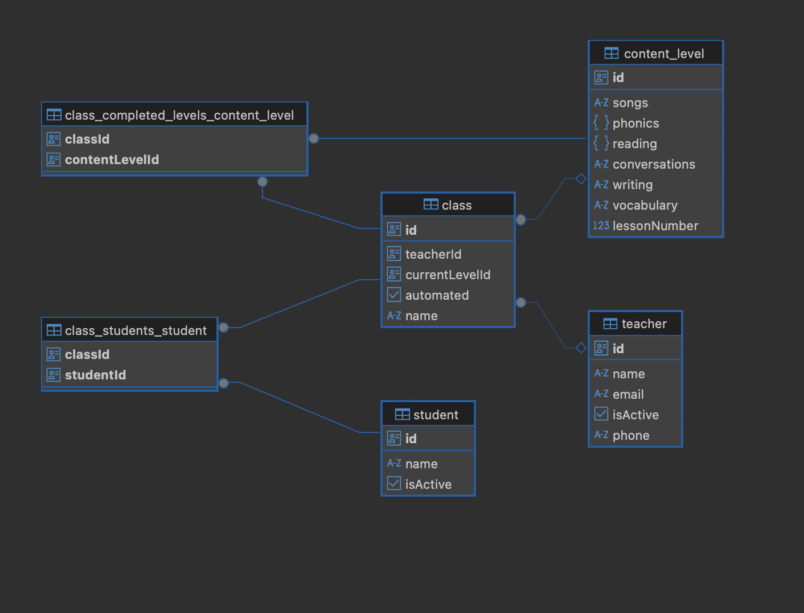
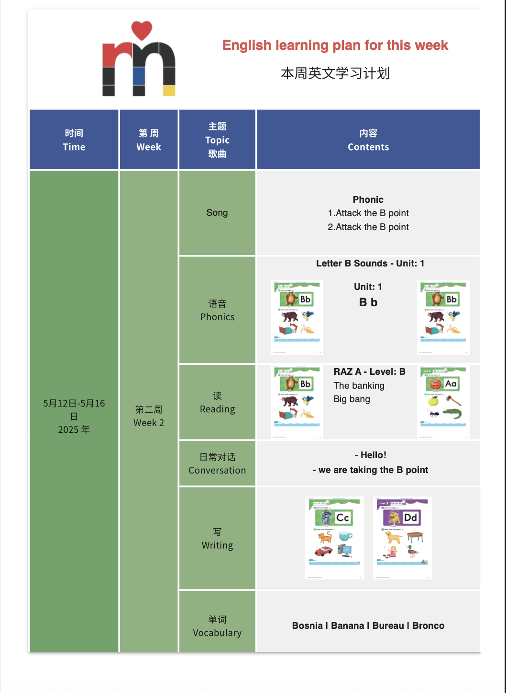

## Welcome!
Hello and welcome, thank you for visiting please feel free to copy, use and change this project as it best fits your needs.

Keep in mind that this project is still a work in progress, so there are things missing and a lot more in the horizon.

## Description

This is a project I decided to build with the specific purpose of automating a small task I must do every Sunday. You see, I'm currently working as an English teacher and every week I need to provide the school I work for with a program laying out the study contents for the students. Since the student's parents are Chinese, the PDF document must include some Mandarin captions.
Personally, I don't like working on Sundays, so I decided to follow the steps of the great [Echo](https://rainbowsix.fandom.com/wiki/Echo_(Siege)) and his motto,
**«efficiency is clever laziness.»**.

## What does it do?
Generate a PDF file from a React App, store it, and deliver it to you by whatever means you see fit. In my case, it will be a WeChat message.

## Which tech are you using?
Starting from back to front, the list is as follows:
* [postgres](https://www.postgresql.org/) This is for our database, and where we'll be storing all our information
* [TypeScript](https://www.typescriptlang.org/) If this needs explaining, I envy your peaceful life offline. But go ahead, click the link—you might just ascend to a higher JavaScript consciousness.
* [pnpm](https://pnpm.io/) npm walked so pnpm could teleport. It’s fast, efficient, and kinda makes you feel like a 10x dev just for using it. Click the link—you’ll never **rm -rf node_modules** the same way again.
* [NestJS](https://nestjs.com/) For our backend API, NestJS: because writing plain Express wasn’t TypeScripty or opinionated enough. Click the link before it decorates you. Decorators are everywhere (I actually love this framework)
* [Vite](https://vite.dev/) Bro is fast
* [React](https://react.dev/) I use React because I like my UI declarative, my state hooks chaotic, and my job market options unreasonable. Embrace the virtual DOM grindset and over-architecting a reusable button.
* [Redux toolkit](https://redux-toolkit.js.org/) Honorable mention.

## How does it do it?
Basically, what it does is trigger a script using [cron](https://en.wikipedia.org/wiki/Cron). The script will start the front-end app and wait for it to be up and running. Once it confirms it's good to go, it will start the NestJS server and wait for it to be ready. The next step is to trigger a request to get some information from the database, as well as increasing the level for that class and returning the new content level for said class. It will proceed to inject this data into the frontend App, mount a headless browser, render the component, and create a PDF file from this to finally store it and deliver it to the teacher running this class by email or WeChat message.

## Data Structure
Here's a cute screenshot I got from DBeaver to explain each entity and its relationships to simplify things.

## Architecture, infrastructure, and deployment, you ask?
Overall, it's a scalable solution, and you can expand on it if you need to. If you need to build more complex solutions, NestJS is great, and relational integrity is solid, as well as using modular design allows easy expansion (e.g., adding more features like attendance, grading, etc, in the future).
The frontend app is using Vite, which is very fast, and React Router is already installed to support navigating without refreshing the page. It also allows us to use browser history features while preserving the right application view.

**The caveat**

By looking into the code, you might realize that some things are a bit odd, like a complete lack of an auth system, such as JWT. That's because while I could deploy this to AWS and use Cognito, EC2 or Lambda, RDS, and S3 using Terraform. I went for the localhost option simply because I'm cheap, or as we call it in my native language," ratón 🐭". The truth is, I'm not paying to work. I can just use ngrok to expose the frontend app for other teachers when they need to use it (it's only 4 of us at this school) so...

## 🔄 Future Considerations
If you intend to deploy this, you might have to include an auth method and some guards in the backend as well as configuring the API properly to handle migrations. You might also need to change a few details in the front to use an actual URL for an image instead of finding them in the public folder.

## The final product? 
Here's an example of one of the generated files. The information here does not reflect the actual contents of a class, it's just placeholder data.
